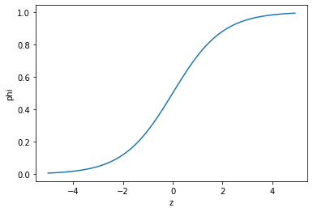

## 04-1 로지스틱 회귀


```python
# k-최근접 이웃 분류기로 럭키백에 들어간 생선의 확률 계산하기
import pandas as pd

fish = pd.read_csv('https://bit.ly/fish_csv_data')
fish.head()
```


<div>
<style scoped>
    .dataframe tbody tr th:only-of-type {
        vertical-align: middle;
    }

    .dataframe tbody tr th {
        vertical-align: top;
    }

    .dataframe thead th {
        text-align: right;
    }
</style>
<table border="1" class="dataframe">
  <thead>
    <tr style="text-align: right;">
      <th></th>
      <th>Species</th>
      <th>Weight</th>
      <th>Length</th>
      <th>Diagonal</th>
      <th>Height</th>
      <th>Width</th>
    </tr>
  </thead>
  <tbody>
    <tr>
      <th>0</th>
      <td>Bream</td>
      <td>242.0</td>
      <td>25.4</td>
      <td>30.0</td>
      <td>11.5200</td>
      <td>4.0200</td>
    </tr>
    <tr>
      <th>1</th>
      <td>Bream</td>
      <td>290.0</td>
      <td>26.3</td>
      <td>31.2</td>
      <td>12.4800</td>
      <td>4.3056</td>
    </tr>
    <tr>
      <th>2</th>
      <td>Bream</td>
      <td>340.0</td>
      <td>26.5</td>
      <td>31.1</td>
      <td>12.3778</td>
      <td>4.6961</td>
    </tr>
    <tr>
      <th>3</th>
      <td>Bream</td>
      <td>363.0</td>
      <td>29.0</td>
      <td>33.5</td>
      <td>12.7300</td>
      <td>4.4555</td>
    </tr>
    <tr>
      <th>4</th>
      <td>Bream</td>
      <td>430.0</td>
      <td>29.0</td>
      <td>34.0</td>
      <td>12.4440</td>
      <td>5.1340</td>
    </tr>
  </tbody>
</table>
</div>


```python
# Species 고유값 추출
print('Species 고유값 추출 :',pd.unique(fish['Species']))
```

    Species 고유값 추출 : ['Bream' 'Roach' 'Whitefish' 'Parkki' 'Perch' 'Pike' 'Smelt']
    


```python
# Species열을 뺀 나머지를 입력데이터로 지정
# 데이터프레임 > numpy 배열로 전환
fish_input = fish[['Weight','Length','Diagonal','Height','Width']].to_numpy()
print('fish_input Data\n',fish_input[:5])

fish_target = fish['Species'].to_numpy()
print('fish_target Data\n',fish_target[:5])
```

    fish_input Data
     [[242.      25.4     30.      11.52     4.02  ]
     [290.      26.3     31.2     12.48     4.3056]
     [340.      26.5     31.1     12.3778   4.6961]
     [363.      29.      33.5     12.73     4.4555]
     [430.      29.      34.      12.444    5.134 ]]
    fish_target Data
     ['Bream' 'Bream' 'Bream' 'Bream' 'Bream']
    


```python
# 분류한 fish데이터를 train 세트와 test세트로 분류

from sklearn.model_selection import train_test_split
train_input, test_input, train_target, test_target = train_test_split(fish_input,fish_target,random_state=42)
```


```python
# 표준화 전처리

from sklearn.preprocessing import StandardScaler

ss = StandardScaler()
ss.fit(train_input)
train_scaled = ss.transform(train_input)
test_scaled = ss.transform(test_input)

print('train_input \n',train_input)
print('test_input \n',test_input)

print('train_scaled \n',train_scaled)
print('test_scaled \n',test_scaled)
```

    train_input 
     [[7.20000e+02 3.50000e+01 4.06000e+01 1.63618e+01 6.09000e+00]
     [5.00000e+02 4.50000e+01 4.80000e+01 6.96000e+00 4.89600e+00]
     [7.50000e+00 1.05000e+01 1.16000e+01 1.97200e+00 1.16000e+00]
     [1.10000e+02 2.20000e+01 2.35000e+01 5.52250e+00 3.99500e+00]
     [1.40000e+02 2.07000e+01 2.32000e+01 8.53760e+00 3.29440e+00]
     [6.90000e+01 1.82000e+01 2.03000e+01 5.29830e+00 2.82170e+00]
     [1.10000e+02 2.10000e+01 2.25000e+01 5.69250e+00 3.55500e+00]
     [6.20000e+02 3.45000e+01 3.97000e+01 1.55227e+01 5.28010e+00]
     [1.30000e+02 2.13000e+01 2.28000e+01 6.38400e+00 3.53400e+00]
     [8.50000e+01 2.00000e+01 2.10000e+01 5.08200e+00 2.77200e+00]
     [6.85000e+02 3.65000e+01 3.90000e+01 1.08810e+01 6.86400e+00]
     [5.00000e+02 3.10000e+01 3.62000e+01 1.43714e+01 4.81460e+00]
     [5.14000e+02 3.28000e+01 3.40000e+01 1.00300e+01 6.01800e+00]
     [2.00000e+02 2.30000e+01 2.58000e+01 1.03458e+01 3.66360e+00]
     [1.00000e+03 4.40000e+01 4.66000e+01 1.24888e+01 7.59580e+00]
     [7.14000e+02 3.60000e+01 4.15000e+01 1.65170e+01 5.85150e+00]
     [8.70000e+00 1.13000e+01 1.26000e+01 1.97820e+00 1.28520e+00]
     [1.00000e+03 4.30000e+01 4.52000e+01 1.19328e+01 7.27720e+00]
     [1.10000e+02 2.08000e+01 2.31000e+01 6.16770e+00 3.39570e+00]
     [4.30000e+02 2.90000e+01 3.40000e+01 1.24440e+01 5.13400e+00]
     [4.56000e+02 4.25000e+01 4.55000e+01 7.28000e+00 4.32250e+00]
     [9.25000e+02 3.95000e+01 4.53000e+01 1.87542e+01 6.74970e+00]
     [9.50000e+02 5.17000e+01 5.51000e+01 8.92620e+00 6.17120e+00]
     [2.50000e+02 2.75000e+01 2.89000e+01 7.28280e+00 4.56620e+00]
     [1.70000e+02 2.07000e+01 2.32000e+01 9.39600e+00 3.41040e+00]
     [4.75000e+02 3.10000e+01 3.62000e+01 1.42628e+01 5.10420e+00]
     [1.45000e+02 2.27000e+01 2.42000e+01 5.95320e+00 3.63000e+00]
     [3.00000e+02 3.73000e+01 3.98000e+01 6.28840e+00 4.01980e+00]
     [2.42000e+02 2.54000e+01 3.00000e+01 1.15200e+01 4.02000e+00]
     [6.50000e+02 3.90000e+01 4.14000e+01 1.11366e+01 6.00300e+00]
     [1.20000e+02 1.90000e+01 2.13000e+01 8.39220e+00 2.91810e+00]
     [1.45000e+02 2.20000e+01 2.43000e+01 6.63390e+00 3.54780e+00]
     [1.25000e+02 2.10000e+01 2.25000e+01 5.69250e+00 3.66750e+00]
     [8.50000e+02 3.60000e+01 4.16000e+01 1.68896e+01 6.19840e+00]
     [0.00000e+00 2.05000e+01 2.28000e+01 6.47520e+00 3.35160e+00]
     [8.40000e+02 3.50000e+01 3.73000e+01 1.14884e+01 7.79570e+00]
     [7.25000e+02 3.50000e+01 4.09000e+01 1.63600e+01 6.05320e+00]
     [6.80000e+02 3.50000e+01 4.06000e+01 1.54686e+01 6.13060e+00]
     [6.90000e+02 3.70000e+01 3.93000e+01 1.05717e+01 6.36660e+00]
     [8.00000e+01 1.90000e+01 2.02000e+01 5.63580e+00 3.05020e+00]
     [1.20000e+02 2.00000e+01 2.22000e+01 6.21600e+00 3.57420e+00]
     [1.60000e+03 6.00000e+01 6.40000e+01 9.60000e+00 6.14400e+00]
     [2.65000e+02 2.75000e+01 2.89000e+01 7.05160e+00 4.33500e+00]
     [1.22000e+01 1.22000e+01 1.34000e+01 2.09040e+00 1.39360e+00]
     [3.45000e+02 3.85000e+01 4.10000e+01 6.39600e+00 3.97700e+00]
     [1.60000e+02 2.25000e+01 2.50000e+01 6.40000e+00 3.80000e+00]
     [8.50000e+02 4.00000e+01 4.23000e+01 1.19286e+01 7.10640e+00]
     [5.50000e+01 1.47000e+01 1.65000e+01 6.84750e+00 2.32650e+00]
     [3.20000e+01 1.37000e+01 1.47000e+01 3.52800e+00 1.99920e+00]
     [9.75000e+02 4.10000e+01 4.59000e+01 1.86354e+01 6.74730e+00]
     [3.20000e+02 3.00000e+01 3.16000e+01 7.61560e+00 4.77160e+00]
     [9.70000e+00 1.10000e+01 1.20000e+01 2.19600e+00 1.38000e+00]
     [1.10000e+03 4.20000e+01 4.46000e+01 1.28002e+01 6.86840e+00]
     [6.00000e+01 1.55000e+01 1.74000e+01 6.57720e+00 2.31420e+00]
     [1.97000e+01 1.43000e+01 1.52000e+01 2.87280e+00 2.06720e+00]
     [1.45000e+02 2.40000e+01 2.55000e+01 6.37500e+00 3.82500e+00]
     [1.97000e+02 2.56000e+01 2.70000e+01 6.56100e+00 4.23900e+00]
     [2.72000e+02 2.70000e+01 3.06000e+01 8.56800e+00 4.77360e+00]
     [4.50000e+02 2.97000e+01 3.47000e+01 1.36024e+01 4.92740e+00]
     [7.00000e+02 3.70000e+01 3.94000e+01 1.08350e+01 6.26460e+00]
     [8.20000e+02 4.00000e+01 4.25000e+01 1.11350e+01 6.63000e+00]
     [1.61000e+02 2.34000e+01 2.67000e+01 6.91530e+00 3.63120e+00]
     [4.00000e+01 1.41000e+01 1.62000e+01 4.14720e+00 2.26800e+00]
     [8.50000e+01 1.96000e+01 2.08000e+01 5.13760e+00 3.03680e+00]
     [1.00000e+02 1.80000e+01 1.92000e+01 5.22240e+00 3.32160e+00]
     [9.50000e+02 4.10000e+01 4.65000e+01 1.76235e+01 6.37050e+00]
     [1.40000e+02 2.25000e+01 2.50000e+01 6.55000e+00 3.32500e+00]
     [3.90000e+02 3.00000e+01 3.50000e+01 1.26700e+01 4.69000e+00]
     [1.50000e+02 2.20000e+01 2.47000e+01 5.80450e+00 3.75440e+00]
     [2.73000e+02 2.50000e+01 2.80000e+01 1.10880e+01 4.14400e+00]
     [9.00000e+02 4.00000e+01 4.25000e+01 1.17300e+01 7.22500e+00]
     [5.56000e+02 3.45000e+01 3.65000e+01 1.02565e+01 6.38750e+00]
     [1.30000e+02 2.25000e+01 2.40000e+01 5.85600e+00 3.62400e+00]
     [1.15000e+02 2.10000e+01 2.25000e+01 5.91750e+00 3.30750e+00]
     [1.55000e+03 6.00000e+01 6.40000e+01 9.60000e+00 6.14400e+00]
     [1.65000e+03 6.34000e+01 6.80000e+01 1.08120e+01 7.48000e+00]
     [1.35000e+02 2.20000e+01 2.35000e+01 5.87500e+00 3.52500e+00]
     [4.50000e+02 3.00000e+01 3.51000e+01 1.40049e+01 4.84380e+00]
     [7.00000e+02 3.60000e+01 3.83000e+01 1.06091e+01 6.74080e+00]
     [3.40000e+02 3.20000e+01 3.73000e+01 1.39129e+01 5.07280e+00]
     [8.00000e+02 3.64000e+01 3.96000e+01 1.17612e+01 6.57360e+00]
     [5.40000e+02 4.30000e+01 4.58000e+01 7.78600e+00 5.12960e+00]
     [3.63000e+02 2.90000e+01 3.35000e+01 1.27300e+01 4.45550e+00]
     [7.00000e+02 3.30000e+01 3.85000e+01 1.49380e+01 5.19750e+00]
     [8.70000e+01 1.98000e+01 2.22000e+01 5.61660e+00 3.17460e+00]
     [5.90000e+00 8.40000e+00 8.80000e+00 2.11200e+00 1.40800e+00]
     [7.70000e+02 4.80000e+01 5.12000e+01 7.68000e+00 5.37600e+00]
     [5.00000e+02 2.97000e+01 3.45000e+01 1.41795e+01 5.27850e+00]
     [4.30000e+02 3.80000e+01 4.05000e+01 7.29000e+00 4.57650e+00]
     [9.00000e+01 1.77000e+01 1.98000e+01 7.40520e+00 2.67300e+00]
     [3.90000e+02 3.17000e+01 3.50000e+01 9.48500e+00 5.35500e+00]
     [3.00000e+02 2.87000e+01 3.01000e+01 7.58520e+00 4.63540e+00]
     [2.00000e+02 2.35000e+01 2.68000e+01 7.39680e+00 4.12720e+00]
     [1.22000e+01 1.30000e+01 1.38000e+01 2.27700e+00 1.25580e+00]
     [5.40000e+02 3.10000e+01 3.40000e+01 1.07440e+01 6.56200e+00]
     [1.69000e+02 2.40000e+01 2.72000e+01 7.53440e+00 3.83520e+00]
     [1.30000e+02 2.20000e+01 2.35000e+01 6.11000e+00 3.52500e+00]
     [6.85000e+02 3.40000e+01 3.92000e+01 1.59936e+01 5.37040e+00]
     [3.06000e+02 2.80000e+01 3.08000e+01 8.77800e+00 4.68160e+00]
     [9.80000e+00 1.20000e+01 1.32000e+01 2.20440e+00 1.14840e+00]
     [3.00000e+02 3.40000e+01 3.78000e+01 5.70780e+00 4.15800e+00]
     [7.80000e+01 1.88000e+01 2.12000e+01 5.57560e+00 2.90440e+00]
     [9.80000e+00 1.12000e+01 1.24000e+01 2.08320e+00 1.27720e+00]
     [2.90000e+02 2.63000e+01 3.12000e+01 1.24800e+01 4.30560e+00]
     [2.90000e+02 2.60000e+01 2.92000e+01 8.87680e+00 4.49680e+00]
     [3.00000e+02 3.50000e+01 3.88000e+01 5.93640e+00 4.38440e+00]
     [2.60000e+02 2.75000e+01 2.89000e+01 7.16720e+00 4.33500e+00]
     [1.80000e+02 2.50000e+01 2.65000e+01 6.43950e+00 3.68350e+00]
     [9.00000e+02 3.90000e+01 4.14000e+01 1.11366e+01 7.49340e+00]
     [1.20000e+02 2.20000e+01 2.35000e+01 5.64000e+00 3.52500e+00]
     [4.00000e+01 1.50000e+01 1.60000e+01 3.82400e+00 2.43200e+00]
     [1.01500e+03 4.00000e+01 4.24000e+01 1.23808e+01 7.46240e+00]
     [1.99000e+01 1.50000e+01 1.62000e+01 2.93220e+00 1.87920e+00]
     [5.75000e+02 3.40000e+01 3.95000e+01 1.51285e+01 5.56950e+00]
     [3.00000e+02 2.60000e+01 2.90000e+01 1.13680e+01 4.23400e+00]
     [2.50000e+02 2.80000e+01 2.94000e+01 7.82040e+00 4.20420e+00]
     [6.00000e+02 3.20000e+01 3.72000e+01 1.49544e+01 5.17080e+00]
     [1.50000e+02 2.25000e+01 2.40000e+01 6.79200e+00 3.62400e+00]
     [3.00000e+02 2.73000e+01 2.87000e+01 8.32300e+00 5.13730e+00]]
    test_input 
     [[7.80000e+01 1.87000e+01 1.94000e+01 5.19920e+00 3.12340e+00]
     [1.34000e+01 1.24000e+01 1.35000e+01 2.43000e+00 1.26900e+00]
     [2.00000e+02 3.23000e+01 3.48000e+01 5.56800e+00 3.37560e+00]
     [2.70000e+02 2.60000e+01 2.87000e+01 8.38040e+00 4.24760e+00]
     [1.50000e+02 2.30000e+01 2.45000e+01 5.21850e+00 3.62600e+00]
     [1.00000e+03 3.70000e+01 4.26000e+01 1.89570e+01 6.60300e+00]
     [7.00000e+00 1.06000e+01 1.16000e+01 1.72840e+00 1.14840e+00]
     [1.80000e+02 2.52000e+01 2.79000e+01 7.08660e+00 3.90600e+00]
     [1.88000e+02 2.46000e+01 2.62000e+01 6.73340e+00 4.16580e+00]
     [1.25000e+03 5.60000e+01 5.97000e+01 1.06863e+01 6.98490e+00]
     [6.50000e+02 3.35000e+01 3.87000e+01 1.44738e+01 5.72760e+00]
     [1.00000e+03 4.00000e+01 4.35000e+01 1.23540e+01 6.52500e+00]
     [6.00000e+02 3.20000e+01 3.72000e+01 1.54380e+01 5.58000e+00]
     [1.50000e+02 2.00000e+01 2.24000e+01 8.89280e+00 3.29280e+00]
     [7.00000e+02 3.50000e+01 4.05000e+01 1.62405e+01 5.58900e+00]
     [9.20000e+02 3.85000e+01 4.41000e+01 1.80369e+01 6.30630e+00]
     [1.00000e+03 4.35000e+01 4.60000e+01 1.26040e+01 8.14200e+00]
     [2.18000e+02 2.65000e+01 2.80000e+01 7.16800e+00 4.14400e+00]
     [2.25000e+02 2.40000e+01 2.55000e+01 7.29300e+00 3.72300e+00]
     [7.00000e+02 3.30000e+01 3.83000e+01 1.48604e+01 5.28540e+00]
     [1.00000e+01 1.18000e+01 1.31000e+01 2.21390e+00 1.28380e+00]
     [6.10000e+02 3.35000e+01 3.86000e+01 1.56330e+01 5.13380e+00]
     [5.00000e+02 3.15000e+01 3.64000e+01 1.37592e+01 4.36800e+00]
     [5.00000e+02 3.07000e+01 3.62000e+01 1.42266e+01 4.95940e+00]
     [9.55000e+02 3.85000e+01 4.40000e+01 1.80840e+01 6.29200e+00]
     [1.10000e+03 4.30000e+01 4.55000e+01 1.25125e+01 7.41650e+00]
     [1.70000e+02 2.35000e+01 2.50000e+01 6.27500e+00 3.72500e+00]
     [2.70000e+02 2.65000e+01 2.93000e+01 8.14540e+00 4.24850e+00]
     [6.70000e+00 9.80000e+00 1.08000e+01 1.73880e+00 1.04760e+00]
     [9.90000e+00 1.18000e+01 1.31000e+01 2.21390e+00 1.16590e+00]
     [5.10000e+02 4.25000e+01 4.55000e+01 6.82500e+00 4.45900e+00]
     [7.00000e+01 1.74000e+01 1.85000e+01 4.58800e+00 2.94150e+00]
     [5.15000e+01 1.62000e+01 1.72000e+01 4.59240e+00 2.63160e+00]
     [5.67000e+02 4.60000e+01 4.87000e+01 7.79200e+00 4.87000e+00]
     [3.40000e+02 2.65000e+01 3.11000e+01 1.23778e+01 4.69610e+00]
     [1.20000e+02 2.20000e+01 2.35000e+01 6.11000e+00 3.40750e+00]
     [1.60000e+02 2.25000e+01 2.53000e+01 7.03340e+00 3.82030e+00]
     [1.20000e+02 2.10000e+01 2.37000e+01 6.11460e+00 3.29430e+00]
     [1.45000e+02 2.15000e+01 2.41000e+01 9.73640e+00 3.15710e+00]
     [8.20000e+02 3.90000e+01 4.13000e+01 1.24313e+01 7.35140e+00]]
    train_scaled 
     [[ 9.19657820e-01  6.09431747e-01  8.10412209e-01  1.85194896e+00
       1.00075672e+00]
     [ 3.00412188e-01  1.54653445e+00  1.45316551e+00 -4.69816625e-01
       2.72917446e-01]
     [-1.08585360e+00 -1.68646987e+00 -1.70848587e+00 -1.70159849e+00
      -2.00447580e+00]
     [-7.97341433e-01 -6.08801762e-01 -6.74869070e-01 -8.24805885e-01
      -2.76314705e-01]
     [-7.12898847e-01 -7.30625113e-01 -7.00926637e-01 -8.02298036e-02
      -7.03386897e-01]
     [-9.12746301e-01 -9.64900787e-01 -9.52816444e-01 -8.80171862e-01
      -9.91535662e-01]
     [-7.97341433e-01 -7.02512032e-01 -7.61727625e-01 -7.82824547e-01
      -5.44530184e-01]
     [ 6.38182533e-01  5.62576612e-01  7.32239510e-01  1.64473401e+00
       5.07057367e-01]
     [-7.41046376e-01 -6.74398951e-01 -7.35670058e-01 -6.12059278e-01
      -5.57331377e-01]
     [-8.67710255e-01 -7.96222301e-01 -8.92015456e-01 -9.33586942e-01
      -1.02183182e+00]
     [ 8.21141469e-01  7.49997152e-01  6.71438522e-01  4.98470601e-01
       1.47257213e+00]
     [ 3.00412188e-01  2.34590667e-01  4.28234570e-01  1.36042157e+00
       2.23297582e-01]
     [ 3.39818728e-01  4.03269153e-01  2.37145751e-01  2.88316959e-01
       9.56866916e-01]
     [-5.44013674e-01 -5.15091492e-01 -4.75094395e-01  3.66303469e-01
      -4.78329727e-01]
     [ 1.70778862e+00  1.45282418e+00  1.33156354e+00  8.95515284e-01
       1.91866324e+00]
     [ 9.02769303e-01  7.03142017e-01  8.88584908e-01  1.89027545e+00
       8.55371741e-01]
     [-1.08247590e+00 -1.61150165e+00 -1.62162731e+00 -1.70006740e+00
      -1.92815631e+00]
     [ 1.70778862e+00  1.35911391e+00  1.20996156e+00  7.58211612e-01
       1.72445085e+00]
     [-7.97341433e-01 -7.21254086e-01 -7.09612492e-01 -6.65474358e-01
      -6.41636379e-01]
     [ 1.03379487e-01  4.71701274e-02  2.37145751e-01  8.84451967e-01
       4.17997636e-01]
     [ 1.76563061e-01  1.31225877e+00  1.23601913e+00 -3.90792929e-01
      -7.66770476e-02]
     [ 1.49668216e+00  1.03112796e+00  1.21864741e+00  2.44274986e+00
       1.40289707e+00]
     [ 1.56705098e+00  2.17439325e+00  2.06986125e+00  1.57345974e-02
       1.05025467e+00]
     [-4.03276031e-01 -9.33952774e-02 -2.05832877e-01 -3.90101472e-01
       7.18777527e-02]
     [-6.28456261e-01 -7.30625113e-01 -7.00926637e-01  1.31751261e-01
      -6.32675543e-01]
     [ 2.30043366e-01  2.34590667e-01  4.28234570e-01  1.33360290e+00
       3.99832133e-01]
     [-6.98825082e-01 -5.43204573e-01 -6.14068082e-01 -7.18444929e-01
      -4.98811636e-01]
     [-2.62538387e-01  8.24965367e-01  7.40925366e-01 -6.35667608e-01
      -2.61197105e-01]
     [-4.25794054e-01 -2.90186844e-01 -1.10288467e-01  6.56271044e-01
      -2.61075189e-01]
     [ 7.22625119e-01  9.84272826e-01  8.79899053e-01  5.61590778e-01
       9.47723207e-01]
     [-7.69193904e-01 -8.89932571e-01 -8.65957890e-01 -1.16136195e-01
      -9.32772089e-01]
     [-6.98825082e-01 -6.08801762e-01 -6.05382227e-01 -5.50346711e-01
      -5.48919164e-01]
     [-7.55120140e-01 -7.02512032e-01 -7.61727625e-01 -7.82824547e-01
      -4.75952362e-01]
     [ 1.28557569e+00  7.03142017e-01  8.97270764e-01  1.98228866e+00
       1.06683526e+00]
     [-1.10696425e+00 -7.49367167e-01 -7.35670058e-01 -5.89537525e-01
      -6.68518884e-01]
     [ 1.25742816e+00  6.09431747e-01  5.23778980e-01  6.48467454e-01
       2.04051841e+00]
     [ 9.33731584e-01  6.09431747e-01  8.36469776e-01  1.85150445e+00
       9.78324154e-01]
     [ 8.07067705e-01  6.09431747e-01  8.10412209e-01  1.63137406e+00
       1.02550570e+00]
     [ 8.35215234e-01  7.96852286e-01  6.97496089e-01  4.22089260e-01
       1.16936672e+00]
     [-8.81784019e-01 -8.89932571e-01 -9.61502300e-01 -7.96826558e-01
      -8.52246487e-01]
     [-7.69193904e-01 -7.96222301e-01 -7.87785191e-01 -6.53546719e-01
      -5.32826236e-01]
     [ 3.39664035e+00  2.95218849e+00  2.84290238e+00  1.82128867e-01
       1.03367408e+00]
     [-3.61054738e-01 -9.33952774e-02 -2.05832877e-01 -4.47196092e-01
      -6.90572897e-02]
     [-1.07262426e+00 -1.52716241e+00 -1.55214047e+00 -1.67235972e+00
      -1.86207776e+00]
     [-1.35874508e-01  9.37417691e-01  8.45155631e-01 -6.09095890e-01
      -2.87287156e-01]
     [-6.56603789e-01 -5.61946627e-01 -5.44581239e-01 -6.08108094e-01
      -3.95182929e-01]
     [ 1.28557569e+00  1.07798310e+00  9.58071752e-01  7.57174426e-01
       1.62033448e+00]
     [-9.52152841e-01 -1.29288673e+00 -1.28287895e+00 -4.97598394e-01
      -1.29339999e+00]
     [-1.01689216e+00 -1.38659700e+00 -1.43922435e+00 -1.31734577e+00
      -1.49291573e+00]
     [ 1.63741980e+00  1.17169337e+00  1.27076255e+00  2.41341232e+00
       1.40143407e+00]
     [-2.06243329e-01  1.40880397e-01  2.86852201e-02 -3.07916828e-01
       1.97085615e-01]
     [-1.07966115e+00 -1.63961473e+00 -1.67374245e+00 -1.64628190e+00
      -1.87036806e+00]
     [ 1.98926391e+00  1.26540364e+00  1.15784643e+00  9.72415218e-01
       1.47525429e+00]
     [-9.38079077e-01 -1.21791852e+00 -1.20470625e+00 -5.64348722e-01
      -1.30089783e+00]
     [-1.05151362e+00 -1.33037084e+00 -1.39579507e+00 -1.47914678e+00
      -1.45146425e+00]
     [-6.98825082e-01 -4.21381222e-01 -5.01151962e-01 -6.14281820e-01
      -3.79943413e-01]
     [-5.52457933e-01 -2.71444790e-01 -3.70864130e-01 -5.68349296e-01
      -1.27577031e-01]
     [-3.41351467e-01 -1.40250412e-01 -5.81733343e-02 -7.27225524e-02
       1.98304776e-01]
     [ 1.59674544e-01  1.12767316e-01  2.97946739e-01  1.17051775e+00
       2.92058277e-01]
     [ 8.63362763e-01  7.96852286e-01  7.06181944e-01  4.87110945e-01
       1.10718950e+00]
     [ 1.20113311e+00  1.07798310e+00  9.75443463e-01  5.61195660e-01
       1.32993026e+00]
     [-6.53789036e-01 -4.77607384e-01 -3.96921696e-01 -4.80855248e-01
      -4.98080139e-01]
     [-9.94374134e-01 -1.34911289e+00 -1.30893652e+00 -1.16443491e+00
      -1.32906046e+00]
     [-8.67710255e-01 -8.33706409e-01 -9.09387167e-01 -9.19856575e-01
      -8.60414868e-01]
     [-8.25488962e-01 -9.83642841e-01 -1.04836085e+00 -8.98915295e-01
      -6.86806303e-01]
     [ 1.56705098e+00  1.17169337e+00  1.32287768e+00  2.16352457e+00
       1.17174409e+00]
     [-7.12898847e-01 -5.61946627e-01 -5.44581239e-01 -5.71065736e-01
      -6.84733729e-01]
     [-9.21062831e-03  1.40880397e-01  3.24004305e-01  9.40262452e-01
       1.47343835e-01]
     [-6.84751318e-01 -6.08801762e-01 -5.70638805e-01 -7.55166253e-01
      -4.22979805e-01]
     [-3.38536715e-01 -3.27670952e-01 -2.84005576e-01  5.49589054e-01
      -1.85487191e-01]
     [ 1.42631334e+00  1.07798310e+00  9.75443463e-01  7.08130345e-01
       1.69263074e+00]
     [ 4.58038349e-01  5.62576612e-01  4.54292136e-01  3.44250919e-01
       1.18210696e+00]
     [-7.41046376e-01 -5.61946627e-01 -6.31439793e-01 -7.42448377e-01
      -5.02469120e-01]
     [-7.83267669e-01 -7.02512032e-01 -7.61727625e-01 -7.27261010e-01
      -6.95401390e-01]
     [ 3.25590271e+00  2.95218849e+00  2.84290238e+00  1.82128867e-01
       1.03367408e+00]
     [ 3.53737799e+00  3.27080341e+00  3.19033660e+00  4.81431116e-01
       1.84807380e+00]
     [-7.26972611e-01 -6.08801762e-01 -6.74869070e-01 -7.37756345e-01
      -5.62817603e-01]
     [ 1.59674544e-01  1.40880397e-01  3.32690160e-01  1.26991474e+00
       2.41097337e-01]
     [ 8.63362763e-01  7.03142017e-01  6.10637534e-01  4.31325154e-01
       1.39747180e+00]
     [-1.49948272e-01  3.28300937e-01  5.23778980e-01  1.24719543e+00
       3.80691302e-01]
     [ 1.14483805e+00  7.40626125e-01  7.23553655e-01  7.15835155e-01
       1.29554992e+00]
     [ 4.13002303e-01  1.35911391e+00  1.26207669e+00 -2.65836710e-01
       4.15315481e-01]
     [-8.52089559e-02  4.71701274e-02  1.93716473e-01  9.55079395e-01
       4.39717660e-03]
     [ 8.63362763e-01  4.22011207e-01  6.28009245e-01  1.50034290e+00
       4.56706006e-01]
     [-8.62080749e-01 -8.14964355e-01 -7.87785191e-01 -8.01567980e-01
      -7.76414657e-01]
     [-1.09035721e+00 -1.88326143e+00 -1.95168982e+00 -1.66702562e+00
      -1.85329980e+00]
     [ 1.06039546e+00  1.82766526e+00  1.73111289e+00 -2.92013309e-01
       5.65516150e-01]
     [ 3.00412188e-01  1.12767316e-01  2.80575028e-01  1.31303204e+00
       5.06082038e-01]
     [ 1.03379487e-01  8.90562556e-01  8.01726354e-01 -3.88323439e-01
       7.81564332e-02]
     [-8.53636490e-01 -1.01175592e+00 -9.96245722e-01 -3.59874908e-01
      -1.08218030e+00]
     [-9.21062831e-03  3.00187856e-01  3.24004305e-01  1.53729727e-01
       5.52714956e-01]
     [-2.62538387e-01  1.90570465e-02 -1.01602612e-01 -3.15424079e-01
       1.14060733e-01]
     [-5.44013674e-01 -4.68236357e-01 -3.88235841e-01 -3.61949280e-01
      -1.95728145e-01]
     [-1.07262426e+00 -1.45219419e+00 -1.51739705e+00 -1.62627903e+00
      -1.94607798e+00]
     [ 4.13002303e-01  2.34590667e-01  2.37145751e-01  4.64638581e-01
       1.28847878e+00]
     [-6.31271013e-01 -4.21381222e-01 -3.53492419e-01 -3.27969091e-01
      -3.73725690e-01]
     [-7.41046376e-01 -6.08801762e-01 -6.74869070e-01 -6.79723318e-01
      -5.62817603e-01]
     [ 8.21141469e-01  5.15721477e-01  6.88810233e-01  1.76102232e+00
       5.62102498e-01]
     [-2.45649870e-01 -4.65401424e-02 -4.08016234e-02 -2.08632519e-02
       1.42223358e-01]
     [-1.07937967e+00 -1.54590446e+00 -1.56951218e+00 -1.64420753e+00
      -2.01154694e+00]
     [-2.62538387e-01  5.15721477e-01  5.67208257e-01 -7.79046226e-01
      -1.76953062e-01]
     [-8.87413525e-01 -9.08674625e-01 -8.74643745e-01 -8.11692891e-01
      -9.41123344e-01]
     [-1.07937967e+00 -1.62087268e+00 -1.63899902e+00 -1.67413775e+00
      -1.93303295e+00]
     [-2.90685916e-01 -2.05847601e-01 -6.05820169e-03  8.93342132e-01
      -8.69789603e-02]
     [-2.90685916e-01 -2.33960682e-01 -1.79775310e-01  3.53531430e-03
       2.95728568e-02]
     [-2.62538387e-01  6.09431747e-01  6.54066812e-01 -7.22593673e-01
      -3.89440064e-02]
     [-3.75128502e-01 -9.33952774e-02 -2.05832877e-01 -4.18648782e-01
      -6.90572897e-02]
     [-6.00308732e-01 -3.27670952e-01 -4.14293407e-01 -5.98353606e-01
      -4.66199072e-01]
     [ 1.42631334e+00  9.84272826e-01  8.79899053e-01  5.61590778e-01
       1.85624218e+00]
     [-7.69193904e-01 -6.08801762e-01 -6.74869070e-01 -7.95789372e-01
      -5.62817603e-01]
     [-9.94374134e-01 -1.26477365e+00 -1.32630823e+00 -1.24424885e+00
      -1.22908923e+00]
     [ 1.75000992e+00  1.07798310e+00  9.66757607e-01  8.68844787e-01
       1.83734518e+00]
     [-1.05095067e+00 -1.26477365e+00 -1.30893652e+00 -1.46447801e+00
      -1.56606541e+00]
     [ 5.11518653e-01  5.15721477e-01  7.14867800e-01  1.54738669e+00
       6.83470002e-01]
     [-2.62538387e-01 -2.33960682e-01 -1.97147021e-01  6.18734788e-01
      -1.30624934e-01]
     [-4.03276031e-01 -4.65401424e-02 -1.62403600e-01 -2.57341662e-01
      -1.48790437e-01]
     [ 5.81887475e-01  3.28300937e-01  5.15093125e-01  1.50439286e+00
       4.40430204e-01]
     [-6.84751318e-01 -5.61946627e-01 -6.31439793e-01 -5.11304066e-01
      -5.02469120e-01]
     [-2.62538387e-01 -1.12137331e-01 -2.23204588e-01 -1.33225070e-01
       4.20009252e-01]]
    test_scaled 
     [[-0.88741352 -0.91804565 -1.03098914 -0.90464451 -0.80762518]
     [-1.06924656 -1.50842035 -1.54345461 -1.58849582 -1.93803151]
     [-0.54401367  0.35641402  0.30663259 -0.8135697  -0.65388895]
     [-0.34698097 -0.23396068 -0.22320459 -0.11905019 -0.12233464]
     [-0.68475132 -0.51509149 -0.58801052 -0.8998784  -0.50124996]
     [ 1.70778862  0.79685229  0.98412932  2.49283113  1.31347159]
     [-1.08726098 -1.67709884 -1.70848587 -1.76175528 -2.01154694]
     [-0.60030873 -0.3089289  -0.29269143 -0.43855288 -0.33056738]
     [-0.57779071 -0.36515506 -0.44035097 -0.52577528 -0.17219833]
     [ 2.41147684  2.57734741  2.4694106   0.45038962  1.54627043]
     [ 0.72262512  0.46886634  0.64538096  1.38570915  0.7798447 ]
     [ 1.70778862  1.0779831   1.06230202  0.86222655  1.2659243 ]
     [ 0.58188748  0.32830094  0.51509312  1.62381742  0.6898706 ]
     [-0.68475132 -0.7962223  -0.77041348  0.0074865  -0.70436223]
     [ 0.86336276  0.60943175  0.80172635  1.82199404  0.69535682]
     [ 1.48260839  0.93741769  1.11441715  2.26561331  1.13260901]
     [ 1.70778862  1.40596904  1.2794484   0.92396381  2.25161618]
     [-0.49334812 -0.18710555 -0.28400558 -0.41845122 -0.18548719]
     [-0.47364485 -0.42138122 -0.50115196 -0.38758259 -0.44212064]
     [ 0.86336276  0.42201121  0.61063753  1.48117965  0.51028814]
     [-1.07881672 -1.56464651 -1.57819804 -1.64186151 -1.92900972]
     [ 0.610035    0.46886634  0.6366951   1.67197249  0.41787572]
     [ 0.30041219  0.2814458   0.44560628  1.20923936 -0.04894113]
     [ 0.30041219  0.20647759  0.42823457  1.32466334  0.31156486]
     [ 1.58112475  0.93741769  1.10573129  2.27724461  1.12389201]
     [ 1.98926391  1.35911391  1.23601913  0.90136798  1.80936543]
     [-0.62845626 -0.46823636 -0.54458124 -0.63897672 -0.44090148]
     [-0.34698097 -0.18710555 -0.17108946 -0.17708322 -0.12178601]
     [-1.0881054  -1.75206705 -1.77797271 -1.75918701 -2.07299266]
     [-1.0790982  -1.56464651 -1.57819804 -1.64186151 -2.00087927]
     [ 0.32855972  1.31225877  1.23601913 -0.50315475  0.00653071]
     [-0.90993155 -1.039869   -1.10916184 -1.05557977 -0.9185079 ]
     [-0.96200448 -1.15232133 -1.22207796 -1.0544932  -1.10741694]
     [ 0.48900063  1.64024472  1.5139665  -0.26435502  0.25706835]
     [-0.14994827 -0.18710555 -0.01474406  0.86810394  0.15106228]
     [-0.7691939  -0.60880176 -0.67486907 -0.67972332 -0.63444333]
     [-0.65660379 -0.56194663 -0.51852367 -0.45169057 -0.38280844]
     [-0.7691939  -0.70251203 -0.65749736 -0.67858735 -0.70344785]
     [-0.69882508 -0.6556569  -0.62275394  0.21581272 -0.78708232]
     [ 1.20113311  0.98427283  0.8712132   0.88131571  1.76968173]]
    


```python
# k-최근접 이웃 분류기의 확률 예측

from sklearn.neighbors import KNeighborsClassifier
# 이웃 수 : count
count = 3
kn = KNeighborsClassifier(n_neighbors=count)
kn.fit(train_scaled, train_target)
print(kn.score(train_scaled, train_target))
print(kn.score(test_scaled, test_target))
```

    0.8907563025210085
    0.85
    


```python
print('target값 확인 \n',kn.classes_)

print(test_scaled[:5])
print('5개 샘플 target값 예측 \n',kn.predict(test_scaled[:5]))
```

    target값 확인 
     ['Bream' 'Parkki' 'Perch' 'Pike' 'Roach' 'Smelt' 'Whitefish']
    [[-0.88741352 -0.91804565 -1.03098914 -0.90464451 -0.80762518]
     [-1.06924656 -1.50842035 -1.54345461 -1.58849582 -1.93803151]
     [-0.54401367  0.35641402  0.30663259 -0.8135697  -0.65388895]
     [-0.34698097 -0.23396068 -0.22320459 -0.11905019 -0.12233464]
     [-0.68475132 -0.51509149 -0.58801052 -0.8998784  -0.50124996]]
    5개 샘플 target값 예측 
     ['Perch' 'Smelt' 'Pike' 'Perch' 'Perch']
    


```python
import numpy as np
proba = kn.predict_proba(test_scaled[:5])
print(kn.classes_,'\n',np.round(proba, decimals=4))
```

    ['Bream' 'Parkki' 'Perch' 'Pike' 'Roach' 'Smelt' 'Whitefish'] 
     [[0.     0.     1.     0.     0.     0.     0.    ]
     [0.     0.     0.     0.     0.     1.     0.    ]
     [0.     0.     0.     1.     0.     0.     0.    ]
     [0.     0.     0.6667 0.     0.3333 0.     0.    ]
     [0.     0.     0.6667 0.     0.3333 0.     0.    ]]
    


```python
# 네 번째 샘플의 최근접 이웃의 클래스 확인
 
distances, indexes = kn.kneighbors(test_scaled[3:4])
print('네 번째 샘플과 가장 이웃한 '+str(count)+'개의 클래스 :',train_target[indexes])
```

    네 번째 샘플과 가장 이웃한 3개의 클래스 : [['Roach' 'Perch' 'Perch']]
    

# 로지스틱 회귀


```python
# 시그모이드 함수 그리기

import numpy as np
import matplotlib.pyplot as plt

z = np.arange(-5,5,0.1)
phi = 1/(1+np.exp(-z))
plt.plot(z,phi)
plt.xlabel('z')
plt.ylabel('phi')
plt.show()
```


    

    


```python
# %불리언 인덱싱으로 A,C만 골라내기

char_arr = np.array(['A','B','C','D','E'])
print(char_arr[[True, False, True, False, False]])
```

    ['A' 'C']
    


```python
# 불리언 인덱싱을 이용하여 Bream과 Smelt행만 골라내기

bream_smelt_indexes = (train_target == 'Bream')|(train_target == 'Smelt')
train_bream_smelt = train_scaled[bream_smelt_indexes]
target_bream_smelt= train_target[bream_smelt_indexes]
```


```python
# 로지스틱회귀모델 훈련

from sklearn.linear_model import LogisticRegression
lr = LogisticRegression()
lr.fit(train_bream_smelt, target_bream_smelt)

# 5개 샘플 예측
print('5개 샘플 예측 :',lr.predict(train_bream_smelt[:5]))
print('예측확률 출력 \n',lr.predict_proba(train_bream_smelt[:5]))
print('Bream과 Smelt중 양성클래스 확인 \n',lr.classes_)
print('계수 확인 : ', lr.coef_, lr.intercept_)
print('샘플 5개 z값 계산 \n',lr.decision_function(train_bream_smelt[:5]))
from scipy.special import expit
print('decisions 배열 확률로 변환 \n',expit(lr.decision_function(train_bream_smelt[:5])))
```

    5개 샘플 예측 : ['Bream' 'Smelt' 'Bream' 'Bream' 'Bream']
    예측확률 출력 
     [[0.99759855 0.00240145]
     [0.02735183 0.97264817]
     [0.99486072 0.00513928]
     [0.98584202 0.01415798]
     [0.99767269 0.00232731]]
    Bream과 Smelt중 양성클래스 확인 
     ['Bream' 'Smelt']
    계수 확인 :  [[-0.4037798  -0.57620209 -0.66280298 -1.01290277 -0.73168947]] [-2.16155132]
    샘플 5개 z값 계산 
     [-6.02927744  3.57123907 -5.26568906 -4.24321775 -6.0607117 ]
    decisions 배열 확률로 변환 
     [0.00240145 0.97264817 0.00513928 0.01415798 0.00232731]
    


```python
# 로지스틱 회귀로 다중 분류 수행하기

lr = LogisticRegression(C=20, max_iter=1000)
lr.fit(train_scaled, train_target)
print(lr.score(train_scaled, train_target))
print(lr.score(test_scaled, test_target))
proba = lr.predict_proba(test_scaled[:5])
print('5개 샘플 예측 :',proba)
print('예측확률 출력 \n',np.round(lr.predict_proba(test_scaled[:5]),decimals=3))
print('클래스 정보 확인 \n',lr.classes_)
print('계수 확인 : ', lr.coef_.shape, lr.intercept_.shape)
```

    0.9327731092436975
    0.925
    5개 샘플 예측 : [[7.25010796e-06 1.35122184e-02 8.41272802e-01 3.14325774e-04
      1.35670201e-01 6.67127088e-03 2.55193226e-03]
     [7.15127184e-09 2.55606529e-03 4.39087352e-02 3.38007666e-05
      7.31090852e-03 9.46185227e-01 5.25572694e-06]
     [1.86559646e-05 2.79662360e-06 3.40600104e-02 9.34804501e-01
      1.50475962e-02 1.60367775e-02 2.96619098e-05]
     [1.09326228e-02 3.40498583e-02 3.05543975e-01 6.60910568e-03
      5.66576740e-01 6.87256768e-05 7.62189727e-02]
     [4.48995860e-06 3.67292847e-04 9.04002342e-01 2.41273299e-03
      8.94746237e-02 2.40966002e-03 1.32885887e-03]]
    예측확률 출력 
     [[0.    0.014 0.841 0.    0.136 0.007 0.003]
     [0.    0.003 0.044 0.    0.007 0.946 0.   ]
     [0.    0.    0.034 0.935 0.015 0.016 0.   ]
     [0.011 0.034 0.306 0.007 0.567 0.    0.076]
     [0.    0.    0.904 0.002 0.089 0.002 0.001]]
    클래스 정보 확인 
     ['Bream' 'Parkki' 'Perch' 'Pike' 'Roach' 'Smelt' 'Whitefish']
    계수 확인 :  (7, 5) (7,)
    


```python
# 소프트맥스 함수

print('클래스 정보 확인 \n',lr.classes_)
decision = lr.decision_function(test_scaled[:5])
print(np.round(decision, decimals=2))

from scipy.special import softmax

proba = softmax(decision, axis=1)
print(np.round(proba, decimals=3))
```

    클래스 정보 확인 
     ['Bream' 'Parkki' 'Perch' 'Pike' 'Roach' 'Smelt' 'Whitefish']
    [[ -6.5    1.03   5.16  -2.73   3.34   0.33  -0.63]
     [-10.86   1.93   4.77  -2.4    2.98   7.84  -4.26]
     [ -4.34  -6.23   3.17   6.49   2.36   2.42  -3.87]
     [ -0.68   0.45   2.65  -1.19   3.26  -5.75   1.26]
     [ -6.4   -1.99   5.82  -0.11   3.5   -0.11  -0.71]]
    [[0.    0.014 0.841 0.    0.136 0.007 0.003]
     [0.    0.003 0.044 0.    0.007 0.946 0.   ]
     [0.    0.    0.034 0.935 0.015 0.016 0.   ]
     [0.011 0.034 0.306 0.007 0.567 0.    0.076]
     [0.    0.    0.904 0.002 0.089 0.002 0.001]]
    

## 04-2 확률적 경사 하강법


```python
#PANDAS 데이터 프레임 만들기
import pandas as pd
fish = pd.read_csv('https://bit.ly/fish_csv_data')
fish
```


<div>
<style scoped>
    .dataframe tbody tr th:only-of-type {
        vertical-align: middle;
    }

    .dataframe tbody tr th {
        vertical-align: top;
    }

    .dataframe thead th {
        text-align: right;
    }
</style>
<table border="1" class="dataframe">
  <thead>
    <tr style="text-align: right;">
      <th></th>
      <th>Species</th>
      <th>Weight</th>
      <th>Length</th>
      <th>Diagonal</th>
      <th>Height</th>
      <th>Width</th>
    </tr>
  </thead>
  <tbody>
    <tr>
      <th>0</th>
      <td>Bream</td>
      <td>242.0</td>
      <td>25.4</td>
      <td>30.0</td>
      <td>11.5200</td>
      <td>4.0200</td>
    </tr>
    <tr>
      <th>1</th>
      <td>Bream</td>
      <td>290.0</td>
      <td>26.3</td>
      <td>31.2</td>
      <td>12.4800</td>
      <td>4.3056</td>
    </tr>
    <tr>
      <th>2</th>
      <td>Bream</td>
      <td>340.0</td>
      <td>26.5</td>
      <td>31.1</td>
      <td>12.3778</td>
      <td>4.6961</td>
    </tr>
    <tr>
      <th>3</th>
      <td>Bream</td>
      <td>363.0</td>
      <td>29.0</td>
      <td>33.5</td>
      <td>12.7300</td>
      <td>4.4555</td>
    </tr>
    <tr>
      <th>4</th>
      <td>Bream</td>
      <td>430.0</td>
      <td>29.0</td>
      <td>34.0</td>
      <td>12.4440</td>
      <td>5.1340</td>
    </tr>
    <tr>
      <th>...</th>
      <td>...</td>
      <td>...</td>
      <td>...</td>
      <td>...</td>
      <td>...</td>
      <td>...</td>
    </tr>
    <tr>
      <th>154</th>
      <td>Smelt</td>
      <td>12.2</td>
      <td>12.2</td>
      <td>13.4</td>
      <td>2.0904</td>
      <td>1.3936</td>
    </tr>
    <tr>
      <th>155</th>
      <td>Smelt</td>
      <td>13.4</td>
      <td>12.4</td>
      <td>13.5</td>
      <td>2.4300</td>
      <td>1.2690</td>
    </tr>
    <tr>
      <th>156</th>
      <td>Smelt</td>
      <td>12.2</td>
      <td>13.0</td>
      <td>13.8</td>
      <td>2.2770</td>
      <td>1.2558</td>
    </tr>
    <tr>
      <th>157</th>
      <td>Smelt</td>
      <td>19.7</td>
      <td>14.3</td>
      <td>15.2</td>
      <td>2.8728</td>
      <td>2.0672</td>
    </tr>
    <tr>
      <th>158</th>
      <td>Smelt</td>
      <td>19.9</td>
      <td>15.0</td>
      <td>16.2</td>
      <td>2.9322</td>
      <td>1.8792</td>
    </tr>
  </tbody>
</table>
<p>159 rows × 6 columns</p>
</div>


```python
# Species 열을 제외한 나머지 5개를 입력데이터로 사용
# Species 열은 타겟 데이터로 사용
fish_input = fish[['Weight','Length','Diagonal','Height','Width']].to_numpy()
fish_target = fish['Species'].to_numpy()
```


```python
# 훈련세트 테스트세트 지정
from sklearn.model_selection import train_test_split
train_input, test_input, train_target, test_target = train_test_split(fish_input,fish_target,random_state=42)
```


```python
# 표준화 전처리
from sklearn.preprocessing import StandardScaler
ss = StandardScaler()
ss.fit(train_input)
train_scaled = ss.transform(train_input)
test_scaled = ss.transform(test_input)

print('train_scaled : ',train_scaled)
print('test_scaled : ',test_scaled)
```

    train_scaled :  [[ 9.19657820e-01  6.09431747e-01  8.10412209e-01  1.85194896e+00
       1.00075672e+00]
     [ 3.00412188e-01  1.54653445e+00  1.45316551e+00 -4.69816625e-01
       2.72917446e-01]
     [-1.08585360e+00 -1.68646987e+00 -1.70848587e+00 -1.70159849e+00
      -2.00447580e+00]
     [-7.97341433e-01 -6.08801762e-01 -6.74869070e-01 -8.24805885e-01
      -2.76314705e-01]
     [-7.12898847e-01 -7.30625113e-01 -7.00926637e-01 -8.02298036e-02
      -7.03386897e-01]
     [-9.12746301e-01 -9.64900787e-01 -9.52816444e-01 -8.80171862e-01
      -9.91535662e-01]
     [-7.97341433e-01 -7.02512032e-01 -7.61727625e-01 -7.82824547e-01
      -5.44530184e-01]
     [ 6.38182533e-01  5.62576612e-01  7.32239510e-01  1.64473401e+00
       5.07057367e-01]
     [-7.41046376e-01 -6.74398951e-01 -7.35670058e-01 -6.12059278e-01
      -5.57331377e-01]
     [-8.67710255e-01 -7.96222301e-01 -8.92015456e-01 -9.33586942e-01
      -1.02183182e+00]
     [ 8.21141469e-01  7.49997152e-01  6.71438522e-01  4.98470601e-01
       1.47257213e+00]
     [ 3.00412188e-01  2.34590667e-01  4.28234570e-01  1.36042157e+00
       2.23297582e-01]
     [ 3.39818728e-01  4.03269153e-01  2.37145751e-01  2.88316959e-01
       9.56866916e-01]
     [-5.44013674e-01 -5.15091492e-01 -4.75094395e-01  3.66303469e-01
      -4.78329727e-01]
     [ 1.70778862e+00  1.45282418e+00  1.33156354e+00  8.95515284e-01
       1.91866324e+00]
     [ 9.02769303e-01  7.03142017e-01  8.88584908e-01  1.89027545e+00
       8.55371741e-01]
     [-1.08247590e+00 -1.61150165e+00 -1.62162731e+00 -1.70006740e+00
      -1.92815631e+00]
     [ 1.70778862e+00  1.35911391e+00  1.20996156e+00  7.58211612e-01
       1.72445085e+00]
     [-7.97341433e-01 -7.21254086e-01 -7.09612492e-01 -6.65474358e-01
      -6.41636379e-01]
     [ 1.03379487e-01  4.71701274e-02  2.37145751e-01  8.84451967e-01
       4.17997636e-01]
     [ 1.76563061e-01  1.31225877e+00  1.23601913e+00 -3.90792929e-01
      -7.66770476e-02]
     [ 1.49668216e+00  1.03112796e+00  1.21864741e+00  2.44274986e+00
       1.40289707e+00]
     [ 1.56705098e+00  2.17439325e+00  2.06986125e+00  1.57345974e-02
       1.05025467e+00]
     [-4.03276031e-01 -9.33952774e-02 -2.05832877e-01 -3.90101472e-01
       7.18777527e-02]
     [-6.28456261e-01 -7.30625113e-01 -7.00926637e-01  1.31751261e-01
      -6.32675543e-01]
     [ 2.30043366e-01  2.34590667e-01  4.28234570e-01  1.33360290e+00
       3.99832133e-01]
     [-6.98825082e-01 -5.43204573e-01 -6.14068082e-01 -7.18444929e-01
      -4.98811636e-01]
     [-2.62538387e-01  8.24965367e-01  7.40925366e-01 -6.35667608e-01
      -2.61197105e-01]
     [-4.25794054e-01 -2.90186844e-01 -1.10288467e-01  6.56271044e-01
      -2.61075189e-01]
     [ 7.22625119e-01  9.84272826e-01  8.79899053e-01  5.61590778e-01
       9.47723207e-01]
     [-7.69193904e-01 -8.89932571e-01 -8.65957890e-01 -1.16136195e-01
      -9.32772089e-01]
     [-6.98825082e-01 -6.08801762e-01 -6.05382227e-01 -5.50346711e-01
      -5.48919164e-01]
     [-7.55120140e-01 -7.02512032e-01 -7.61727625e-01 -7.82824547e-01
      -4.75952362e-01]
     [ 1.28557569e+00  7.03142017e-01  8.97270764e-01  1.98228866e+00
       1.06683526e+00]
     [-1.10696425e+00 -7.49367167e-01 -7.35670058e-01 -5.89537525e-01
      -6.68518884e-01]
     [ 1.25742816e+00  6.09431747e-01  5.23778980e-01  6.48467454e-01
       2.04051841e+00]
     [ 9.33731584e-01  6.09431747e-01  8.36469776e-01  1.85150445e+00
       9.78324154e-01]
     [ 8.07067705e-01  6.09431747e-01  8.10412209e-01  1.63137406e+00
       1.02550570e+00]
     [ 8.35215234e-01  7.96852286e-01  6.97496089e-01  4.22089260e-01
       1.16936672e+00]
     [-8.81784019e-01 -8.89932571e-01 -9.61502300e-01 -7.96826558e-01
      -8.52246487e-01]
     [-7.69193904e-01 -7.96222301e-01 -7.87785191e-01 -6.53546719e-01
      -5.32826236e-01]
     [ 3.39664035e+00  2.95218849e+00  2.84290238e+00  1.82128867e-01
       1.03367408e+00]
     [-3.61054738e-01 -9.33952774e-02 -2.05832877e-01 -4.47196092e-01
      -6.90572897e-02]
     [-1.07262426e+00 -1.52716241e+00 -1.55214047e+00 -1.67235972e+00
      -1.86207776e+00]
     [-1.35874508e-01  9.37417691e-01  8.45155631e-01 -6.09095890e-01
      -2.87287156e-01]
     [-6.56603789e-01 -5.61946627e-01 -5.44581239e-01 -6.08108094e-01
      -3.95182929e-01]
     [ 1.28557569e+00  1.07798310e+00  9.58071752e-01  7.57174426e-01
       1.62033448e+00]
     [-9.52152841e-01 -1.29288673e+00 -1.28287895e+00 -4.97598394e-01
      -1.29339999e+00]
     [-1.01689216e+00 -1.38659700e+00 -1.43922435e+00 -1.31734577e+00
      -1.49291573e+00]
     [ 1.63741980e+00  1.17169337e+00  1.27076255e+00  2.41341232e+00
       1.40143407e+00]
     [-2.06243329e-01  1.40880397e-01  2.86852201e-02 -3.07916828e-01
       1.97085615e-01]
     [-1.07966115e+00 -1.63961473e+00 -1.67374245e+00 -1.64628190e+00
      -1.87036806e+00]
     [ 1.98926391e+00  1.26540364e+00  1.15784643e+00  9.72415218e-01
       1.47525429e+00]
     [-9.38079077e-01 -1.21791852e+00 -1.20470625e+00 -5.64348722e-01
      -1.30089783e+00]
     [-1.05151362e+00 -1.33037084e+00 -1.39579507e+00 -1.47914678e+00
      -1.45146425e+00]
     [-6.98825082e-01 -4.21381222e-01 -5.01151962e-01 -6.14281820e-01
      -3.79943413e-01]
     [-5.52457933e-01 -2.71444790e-01 -3.70864130e-01 -5.68349296e-01
      -1.27577031e-01]
     [-3.41351467e-01 -1.40250412e-01 -5.81733343e-02 -7.27225524e-02
       1.98304776e-01]
     [ 1.59674544e-01  1.12767316e-01  2.97946739e-01  1.17051775e+00
       2.92058277e-01]
     [ 8.63362763e-01  7.96852286e-01  7.06181944e-01  4.87110945e-01
       1.10718950e+00]
     [ 1.20113311e+00  1.07798310e+00  9.75443463e-01  5.61195660e-01
       1.32993026e+00]
     [-6.53789036e-01 -4.77607384e-01 -3.96921696e-01 -4.80855248e-01
      -4.98080139e-01]
     [-9.94374134e-01 -1.34911289e+00 -1.30893652e+00 -1.16443491e+00
      -1.32906046e+00]
     [-8.67710255e-01 -8.33706409e-01 -9.09387167e-01 -9.19856575e-01
      -8.60414868e-01]
     [-8.25488962e-01 -9.83642841e-01 -1.04836085e+00 -8.98915295e-01
      -6.86806303e-01]
     [ 1.56705098e+00  1.17169337e+00  1.32287768e+00  2.16352457e+00
       1.17174409e+00]
     [-7.12898847e-01 -5.61946627e-01 -5.44581239e-01 -5.71065736e-01
      -6.84733729e-01]
     [-9.21062831e-03  1.40880397e-01  3.24004305e-01  9.40262452e-01
       1.47343835e-01]
     [-6.84751318e-01 -6.08801762e-01 -5.70638805e-01 -7.55166253e-01
      -4.22979805e-01]
     [-3.38536715e-01 -3.27670952e-01 -2.84005576e-01  5.49589054e-01
      -1.85487191e-01]
     [ 1.42631334e+00  1.07798310e+00  9.75443463e-01  7.08130345e-01
       1.69263074e+00]
     [ 4.58038349e-01  5.62576612e-01  4.54292136e-01  3.44250919e-01
       1.18210696e+00]
     [-7.41046376e-01 -5.61946627e-01 -6.31439793e-01 -7.42448377e-01
      -5.02469120e-01]
     [-7.83267669e-01 -7.02512032e-01 -7.61727625e-01 -7.27261010e-01
      -6.95401390e-01]
     [ 3.25590271e+00  2.95218849e+00  2.84290238e+00  1.82128867e-01
       1.03367408e+00]
     [ 3.53737799e+00  3.27080341e+00  3.19033660e+00  4.81431116e-01
       1.84807380e+00]
     [-7.26972611e-01 -6.08801762e-01 -6.74869070e-01 -7.37756345e-01
      -5.62817603e-01]
     [ 1.59674544e-01  1.40880397e-01  3.32690160e-01  1.26991474e+00
       2.41097337e-01]
     [ 8.63362763e-01  7.03142017e-01  6.10637534e-01  4.31325154e-01
       1.39747180e+00]
     [-1.49948272e-01  3.28300937e-01  5.23778980e-01  1.24719543e+00
       3.80691302e-01]
     [ 1.14483805e+00  7.40626125e-01  7.23553655e-01  7.15835155e-01
       1.29554992e+00]
     [ 4.13002303e-01  1.35911391e+00  1.26207669e+00 -2.65836710e-01
       4.15315481e-01]
     [-8.52089559e-02  4.71701274e-02  1.93716473e-01  9.55079395e-01
       4.39717660e-03]
     [ 8.63362763e-01  4.22011207e-01  6.28009245e-01  1.50034290e+00
       4.56706006e-01]
     [-8.62080749e-01 -8.14964355e-01 -7.87785191e-01 -8.01567980e-01
      -7.76414657e-01]
     [-1.09035721e+00 -1.88326143e+00 -1.95168982e+00 -1.66702562e+00
      -1.85329980e+00]
     [ 1.06039546e+00  1.82766526e+00  1.73111289e+00 -2.92013309e-01
       5.65516150e-01]
     [ 3.00412188e-01  1.12767316e-01  2.80575028e-01  1.31303204e+00
       5.06082038e-01]
     [ 1.03379487e-01  8.90562556e-01  8.01726354e-01 -3.88323439e-01
       7.81564332e-02]
     [-8.53636490e-01 -1.01175592e+00 -9.96245722e-01 -3.59874908e-01
      -1.08218030e+00]
     [-9.21062831e-03  3.00187856e-01  3.24004305e-01  1.53729727e-01
       5.52714956e-01]
     [-2.62538387e-01  1.90570465e-02 -1.01602612e-01 -3.15424079e-01
       1.14060733e-01]
     [-5.44013674e-01 -4.68236357e-01 -3.88235841e-01 -3.61949280e-01
      -1.95728145e-01]
     [-1.07262426e+00 -1.45219419e+00 -1.51739705e+00 -1.62627903e+00
      -1.94607798e+00]
     [ 4.13002303e-01  2.34590667e-01  2.37145751e-01  4.64638581e-01
       1.28847878e+00]
     [-6.31271013e-01 -4.21381222e-01 -3.53492419e-01 -3.27969091e-01
      -3.73725690e-01]
     [-7.41046376e-01 -6.08801762e-01 -6.74869070e-01 -6.79723318e-01
      -5.62817603e-01]
     [ 8.21141469e-01  5.15721477e-01  6.88810233e-01  1.76102232e+00
       5.62102498e-01]
     [-2.45649870e-01 -4.65401424e-02 -4.08016234e-02 -2.08632519e-02
       1.42223358e-01]
     [-1.07937967e+00 -1.54590446e+00 -1.56951218e+00 -1.64420753e+00
      -2.01154694e+00]
     [-2.62538387e-01  5.15721477e-01  5.67208257e-01 -7.79046226e-01
      -1.76953062e-01]
     [-8.87413525e-01 -9.08674625e-01 -8.74643745e-01 -8.11692891e-01
      -9.41123344e-01]
     [-1.07937967e+00 -1.62087268e+00 -1.63899902e+00 -1.67413775e+00
      -1.93303295e+00]
     [-2.90685916e-01 -2.05847601e-01 -6.05820169e-03  8.93342132e-01
      -8.69789603e-02]
     [-2.90685916e-01 -2.33960682e-01 -1.79775310e-01  3.53531430e-03
       2.95728568e-02]
     [-2.62538387e-01  6.09431747e-01  6.54066812e-01 -7.22593673e-01
      -3.89440064e-02]
     [-3.75128502e-01 -9.33952774e-02 -2.05832877e-01 -4.18648782e-01
      -6.90572897e-02]
     [-6.00308732e-01 -3.27670952e-01 -4.14293407e-01 -5.98353606e-01
      -4.66199072e-01]
     [ 1.42631334e+00  9.84272826e-01  8.79899053e-01  5.61590778e-01
       1.85624218e+00]
     [-7.69193904e-01 -6.08801762e-01 -6.74869070e-01 -7.95789372e-01
      -5.62817603e-01]
     [-9.94374134e-01 -1.26477365e+00 -1.32630823e+00 -1.24424885e+00
      -1.22908923e+00]
     [ 1.75000992e+00  1.07798310e+00  9.66757607e-01  8.68844787e-01
       1.83734518e+00]
     [-1.05095067e+00 -1.26477365e+00 -1.30893652e+00 -1.46447801e+00
      -1.56606541e+00]
     [ 5.11518653e-01  5.15721477e-01  7.14867800e-01  1.54738669e+00
       6.83470002e-01]
     [-2.62538387e-01 -2.33960682e-01 -1.97147021e-01  6.18734788e-01
      -1.30624934e-01]
     [-4.03276031e-01 -4.65401424e-02 -1.62403600e-01 -2.57341662e-01
      -1.48790437e-01]
     [ 5.81887475e-01  3.28300937e-01  5.15093125e-01  1.50439286e+00
       4.40430204e-01]
     [-6.84751318e-01 -5.61946627e-01 -6.31439793e-01 -5.11304066e-01
      -5.02469120e-01]
     [-2.62538387e-01 -1.12137331e-01 -2.23204588e-01 -1.33225070e-01
       4.20009252e-01]]
    test_scaled :  [[-0.88741352 -0.91804565 -1.03098914 -0.90464451 -0.80762518]
     [-1.06924656 -1.50842035 -1.54345461 -1.58849582 -1.93803151]
     [-0.54401367  0.35641402  0.30663259 -0.8135697  -0.65388895]
     [-0.34698097 -0.23396068 -0.22320459 -0.11905019 -0.12233464]
     [-0.68475132 -0.51509149 -0.58801052 -0.8998784  -0.50124996]
     [ 1.70778862  0.79685229  0.98412932  2.49283113  1.31347159]
     [-1.08726098 -1.67709884 -1.70848587 -1.76175528 -2.01154694]
     [-0.60030873 -0.3089289  -0.29269143 -0.43855288 -0.33056738]
     [-0.57779071 -0.36515506 -0.44035097 -0.52577528 -0.17219833]
     [ 2.41147684  2.57734741  2.4694106   0.45038962  1.54627043]
     [ 0.72262512  0.46886634  0.64538096  1.38570915  0.7798447 ]
     [ 1.70778862  1.0779831   1.06230202  0.86222655  1.2659243 ]
     [ 0.58188748  0.32830094  0.51509312  1.62381742  0.6898706 ]
     [-0.68475132 -0.7962223  -0.77041348  0.0074865  -0.70436223]
     [ 0.86336276  0.60943175  0.80172635  1.82199404  0.69535682]
     [ 1.48260839  0.93741769  1.11441715  2.26561331  1.13260901]
     [ 1.70778862  1.40596904  1.2794484   0.92396381  2.25161618]
     [-0.49334812 -0.18710555 -0.28400558 -0.41845122 -0.18548719]
     [-0.47364485 -0.42138122 -0.50115196 -0.38758259 -0.44212064]
     [ 0.86336276  0.42201121  0.61063753  1.48117965  0.51028814]
     [-1.07881672 -1.56464651 -1.57819804 -1.64186151 -1.92900972]
     [ 0.610035    0.46886634  0.6366951   1.67197249  0.41787572]
     [ 0.30041219  0.2814458   0.44560628  1.20923936 -0.04894113]
     [ 0.30041219  0.20647759  0.42823457  1.32466334  0.31156486]
     [ 1.58112475  0.93741769  1.10573129  2.27724461  1.12389201]
     [ 1.98926391  1.35911391  1.23601913  0.90136798  1.80936543]
     [-0.62845626 -0.46823636 -0.54458124 -0.63897672 -0.44090148]
     [-0.34698097 -0.18710555 -0.17108946 -0.17708322 -0.12178601]
     [-1.0881054  -1.75206705 -1.77797271 -1.75918701 -2.07299266]
     [-1.0790982  -1.56464651 -1.57819804 -1.64186151 -2.00087927]
     [ 0.32855972  1.31225877  1.23601913 -0.50315475  0.00653071]
     [-0.90993155 -1.039869   -1.10916184 -1.05557977 -0.9185079 ]
     [-0.96200448 -1.15232133 -1.22207796 -1.0544932  -1.10741694]
     [ 0.48900063  1.64024472  1.5139665  -0.26435502  0.25706835]
     [-0.14994827 -0.18710555 -0.01474406  0.86810394  0.15106228]
     [-0.7691939  -0.60880176 -0.67486907 -0.67972332 -0.63444333]
     [-0.65660379 -0.56194663 -0.51852367 -0.45169057 -0.38280844]
     [-0.7691939  -0.70251203 -0.65749736 -0.67858735 -0.70344785]
     [-0.69882508 -0.6556569  -0.62275394  0.21581272 -0.78708232]
     [ 1.20113311  0.98427283  0.8712132   0.88131571  1.76968173]]
    


```python
#경사하강법 분류 클래스 import
from sklearn.linear_model import SGDClassifier

sc = SGDClassifier(loss='log', max_iter=10, random_state=42)
sc.fit(train_scaled, train_target)
print(sc.score(train_scaled, train_target))
print(sc.score(test_scaled, test_target))
```

    0.773109243697479
    0.775
    

    C:\Python\Python37\lib\site-packages\sklearn\linear_model\_stochastic_gradient.py:577: ConvergenceWarning: Maximum number of iteration reached before convergence. Consider increasing max_iter to improve the fit.
      ConvergenceWarning)
    


```python
sc.partial_fit(train_scaled, train_target)
print(sc.score(train_scaled, train_target))
print(sc.score(test_scaled, test_target))
```

    0.8151260504201681
    0.85
    


```python
# 그래프를 그리기 위한 사전작업

import numpy as np

sc = SGDClassifier(loss = 'log', random_state= 42)
train_score = []
test_score = []
classes = np.unique(train_target)   #생선데이터 목록
print('생선데이터 목록 : ', classes)

# 1에포크가 증가할때마다 train_score, test_score에 점수 추가
for _ in range(0,300):
    sc.partial_fit(train_scaled, train_target, classes=classes)
    train_score.append(sc.score(train_scaled, train_target))
    test_score.append(sc.score(test_scaled, test_target))
```

    생선데이터 목록 :  ['Bream' 'Parkki' 'Perch' 'Pike' 'Roach' 'Smelt' 'Whitefish']
    


```python
#그래프 그리기
import matplotlib.pyplot as plt
plt.plot(train_score)
plt.plot(test_score)
plt.xlabel('epoch')
plt.ylabel('accuracy')
plt.show()
```


    

    


```python
# SGDClassifier의 반복횟수를 100에 맞추고 다시 훈련
sc = SGDClassifier(loss='log', max_iter=100, tol=None, random_state=42)
sc.fit(train_scaled, train_target)
print(sc.score(train_scaled, train_target))
print(sc.score(test_scaled, test_target))
```

    0.957983193277311
    0.925
    


```python
# hinge손실을 이용한 모델 훈련
sc = SGDClassifier(loss='hinge', max_iter=100, tol=None, random_state=42)
sc.fit(train_scaled, train_target)
print(sc.score(train_scaled, train_target))
print(sc.score(test_scaled, test_target))
```

    0.9495798319327731
    0.925
    
