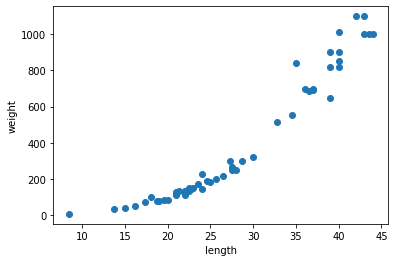
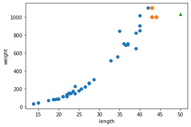
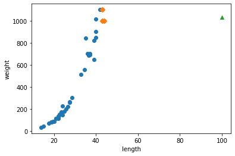
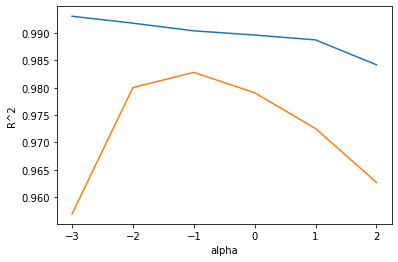

## 03-1 K-최근접 이웃 회귀

---
layout: single
title:  "CHAPTER 03"
categories: AI
---

농어 데이터 준비 : [링크 텍스트](https://bit.ly/perch_data)


```python
import numpy as np

perch_length = np.array([8.4, 13.7, 15.0, 16.2, 17.4, 18.0, 18.7, 19.0, 19.6, 20.0, 21.0,
       21.0, 21.0, 21.3, 22.0, 22.0, 22.0, 22.0, 22.0, 22.5, 22.5, 22.7,
       23.0, 23.5, 24.0, 24.0, 24.6, 25.0, 25.6, 26.5, 27.3, 27.5, 27.5,
       27.5, 28.0, 28.7, 30.0, 32.8, 34.5, 35.0, 36.5, 36.0, 37.0, 37.0,
       39.0, 39.0, 39.0, 40.0, 40.0, 40.0, 40.0, 42.0, 43.0, 43.0, 43.5,
       44.0])
perch_weight = np.array([5.9, 32.0, 40.0, 51.5, 70.0, 100.0, 78.0, 80.0, 85.0, 85.0, 110.0,
       115.0, 125.0, 130.0, 120.0, 120.0, 130.0, 135.0, 110.0, 130.0,
       150.0, 145.0, 150.0, 170.0, 225.0, 145.0, 188.0, 180.0, 197.0,
       218.0, 300.0, 260.0, 265.0, 250.0, 250.0, 300.0, 320.0, 514.0,
       556.0, 840.0, 685.0, 700.0, 700.0, 690.0, 900.0, 650.0, 820.0,
       850.0, 900.0, 1015.0, 820.0, 1100.0, 1000.0, 1100.0, 1000.0,
       1000.0])
```

위 데이터 산점도


```python
import matplotlib.pyplot as plt

plt.scatter(perch_length, perch_weight)
plt.xlabel('length')
plt.ylabel('weight')
plt.show()
```


    

    


길이에 따라 무게도 증가하는 특성을 띄고있음

훈련세트와 테스트세트 분리


```python
from sklearn.model_selection import train_test_split
train_input, test_input, train_target, test_target = train_test_split(perch_length,perch_weight,random_state=42)

print('train_input : ',train_input,',',train_input.shape)
print('test_input : ',test_input,',',test_input.shape)
print('train_target : ',train_target,',',train_target.shape)
print('test_target : ',test_target,',',test_target.shape)
```

    train_input :  [19.6 22.  18.7 17.4 36.  25.  40.  39.  43.  22.  20.  22.  24.  27.5
     43.  40.  24.  21.  27.5 40.  32.8 26.5 36.5 13.7 22.7 15.  37.  35.
     28.7 23.5 39.  21.  23.  22.  44.  22.5 19.  37.  22.  25.6 42.  34.5] , (42,)
    test_input :  [ 8.4 18.  27.5 21.3 22.5 40.  30.  24.6 39.  21.  43.5 16.2 28.  27.3] , (14,)
    train_target :  [  85.  135.   78.   70.  700.  180.  850.  820. 1000.  120.   85.  130.
      225.  260. 1100.  900.  145.  115.  265. 1015.  514.  218.  685.   32.
      145.   40.  690.  840.  300.  170.  650.  110.  150.  110. 1000.  150.
       80.  700.  120.  197. 1100.  556.] , (42,)
    test_target :  [   5.9  100.   250.   130.   130.   820.   320.   188.   900.   125.
     1000.    51.5  250.   300. ] , (14,)
    


```python
# =========== numpy 연습 =========== #
test_array = np.array([1,2,3,4])

# 형태 확인
print(test_array.shape) # (4,)배열

test_array2 = test_array.reshape(2,2) # (2,2)배열로 변환
print(test_array2.shape) #(2,2)배열
print(test_array2)

test_array3 = test_array.reshape(1,4)
print(test_array3.shape)
print(test_array3)
```

    (4,)
    (2, 2)
    [[1 2]
     [3 4]]
    (1, 4)
    [[1 2 3 4]]
    


```python
train_input = train_input.reshape(-1,1)
test_input = test_input.reshape(-1,1)
print(train_input,'\n')
print(test_input,'\n')
print(train_input.shape, test_input.shape)
```

    [[19.6]
     [22. ]
     [18.7]
     [17.4]
     [36. ]
     [25. ]
     [40. ]
     [39. ]
     [43. ]
     [22. ]
     [20. ]
     [22. ]
     [24. ]
     [27.5]
     [43. ]
     [40. ]
     [24. ]
     [21. ]
     [27.5]
     [40. ]
     [32.8]
     [26.5]
     [36.5]
     [13.7]
     [22.7]
     [15. ]
     [37. ]
     [35. ]
     [28.7]
     [23.5]
     [39. ]
     [21. ]
     [23. ]
     [22. ]
     [44. ]
     [22.5]
     [19. ]
     [37. ]
     [22. ]
     [25.6]
     [42. ]
     [34.5]] 
    
    [[ 8.4]
     [18. ]
     [27.5]
     [21.3]
     [22.5]
     [40. ]
     [30. ]
     [24.6]
     [39. ]
     [21. ]
     [43.5]
     [16.2]
     [28. ]
     [27.3]] 
    
    (42, 1) (14, 1)
    

결정계수(R^)


```python
from sklearn.neighbors import KNeighborsRegressor

knr = KNeighborsRegressor()

knr.fit(train_input, train_target)

print(knr.score(test_input, test_target))
```

    0.992809406101064
    

타깃과 예측의 절댓값 오차의 평균


```python
from sklearn.metrics import mean_absolute_error

# 테스트 세트에 대한 에측을 만듭니다.
test_prediction = knr.predict(test_input)

# x테스트 세트에 대한 평균 절댓값 오차를 계산
mae = mean_absolute_error(test_target, test_prediction)
print('MAE : ',mae)
print('R^  : ', knr.score(train_input,train_target))
```

    MAE :  19.157142857142862
    R^  :  0.9698823289099254
    


```python
# neighobrs 갯수 3
knr.n_neighbors = 3

# 모델 훈련
knr.fit(train_input,train_target)
print('R^  : ', knr.score(train_input,train_target))
```

    R^  :  0.9804899950518966
    


```python
print(knr.score(test_input,test_target))
```

    0.9746459963987609
    

## 03-2 선형회귀


```python
import numpy as np

perch_length = np.array([8.4, 13.7, 15.0, 16.2, 17.4, 18.0, 18.7, 19.0, 19.6, 20.0, 21.0,
       21.0, 21.0, 21.3, 22.0, 22.0, 22.0, 22.0, 22.0, 22.5, 22.5, 22.7,
       23.0, 23.5, 24.0, 24.0, 24.6, 25.0, 25.6, 26.5, 27.3, 27.5, 27.5,
       27.5, 28.0, 28.7, 30.0, 32.8, 34.5, 35.0, 36.5, 36.0, 37.0, 37.0,
       39.0, 39.0, 39.0, 40.0, 40.0, 40.0, 40.0, 42.0, 43.0, 43.0, 43.5,
       44.0])
perch_weight = np.array([5.9, 32.0, 40.0, 51.5, 70.0, 100.0, 78.0, 80.0, 85.0, 85.0, 110.0,
       115.0, 125.0, 130.0, 120.0, 120.0, 130.0, 135.0, 110.0, 130.0,
       150.0, 145.0, 150.0, 170.0, 225.0, 145.0, 188.0, 180.0, 197.0,
       218.0, 300.0, 260.0, 265.0, 250.0, 250.0, 300.0, 320.0, 514.0,
       556.0, 840.0, 685.0, 700.0, 700.0, 690.0, 900.0, 650.0, 820.0,
       850.0, 900.0, 1015.0, 820.0, 1100.0, 1000.0, 1100.0, 1000.0,
       1000.0])
```


```python
from sklearn.model_selection import train_test_split
train_input, test_input, train_target, test_target = train_test_split(perch_length,perch_weight,random_state=42)

train_input = train_input.reshape(-1,1)
test_input = test_input.reshape(-1,1)
```


```python
from sklearn.neighbors import KNeighborsRegressor

knr = KNeighborsRegressor(n_neighbors=3)

knr.fit(train_input, train_target)

print(knr.predict([[50]]))
```

    [1033.33333333]
    


```python
import matplotlib.pyplot as plt

# 50cm 농어의 이웃 구하기
distances, indexes = knr.kneighbors([[50]])

# 훈련 세트의 산점도
plt.scatter(train_input, train_target)

# 훈련 세트 중에서 이웃 샘플만 다시 그리기
plt.scatter(train_input[indexes], train_target[indexes], marker='D')

#50cm 농어 데이터
plt.scatter(50, 1033, marker='^')
plt.xlabel('length')
plt.ylabel('weight')
plt.show()
```


    

    


```python
print(np.mean(train_target[indexes]))
print(knr.predict([[100]]))
```

    1033.3333333333333
    [1033.33333333]
    


```python
# 100cm 농어의 이웃 구하기
distances, indexes = knr.kneighbors([[100]])

# 훈련 세트의 산점도
plt.scatter(train_input, train_target)

# 훈련 세트 중에서 이웃 샘플만 다시 그리기
plt.scatter(train_input[indexes], train_target[indexes], marker='D')

#50cm 농어 데이터
plt.scatter(100, 1033, marker='^')
plt.xlabel('length')
plt.ylabel('weight')
plt.show()
```


    

    


```python
from sklearn.linear_model import LinearRegression
lr = LinearRegression()

#선형 회귀 모델 훈련
lr.fit(train_input, train_target)

#50cm 농어 무게 예측
print(lr.predict([[50]]))

print('기울기 x : ',lr.coef_, ' y절편',lr.intercept_)
```

    [1241.83860323]
    기울기 x :  [39.01714496]  y절편 -709.0186449535474
    

학습한 직선 그리기


```python
# 훈련 세트의 산점도
plt.scatter(train_input, train_target)

# 15 - 50 1차 방정식
plt.plot([15,50], [15*lr.coef_+lr.intercept_, 50*lr.coef_+lr.intercept_])

# 50cm 농어 데이터
plt.scatter(50, 1241, marker='^')
plt.xlabel('length')
plt.ylabel('weight')
plt.show()
```


    

    


다항회귀


```python
# 데이터셋에 있는 모든 요소 제곱 **2
train_poly = np.column_stack((train_input ** 2, train_input))
test_poly = np.column_stack((test_input ** 2, test_input))

# 데이터셋 크기 확인
print(train_poly.shape, test_poly.shape)
print(train_poly,'\n',test_poly)
```

    (42, 2) (14, 2)
    [[ 384.16   19.6 ]
     [ 484.     22.  ]
     [ 349.69   18.7 ]
     [ 302.76   17.4 ]
     [1296.     36.  ]
     [ 625.     25.  ]
     [1600.     40.  ]
     [1521.     39.  ]
     [1849.     43.  ]
     [ 484.     22.  ]
     [ 400.     20.  ]
     [ 484.     22.  ]
     [ 576.     24.  ]
     [ 756.25   27.5 ]
     [1849.     43.  ]
     [1600.     40.  ]
     [ 576.     24.  ]
     [ 441.     21.  ]
     [ 756.25   27.5 ]
     [1600.     40.  ]
     [1075.84   32.8 ]
     [ 702.25   26.5 ]
     [1332.25   36.5 ]
     [ 187.69   13.7 ]
     [ 515.29   22.7 ]
     [ 225.     15.  ]
     [1369.     37.  ]
     [1225.     35.  ]
     [ 823.69   28.7 ]
     [ 552.25   23.5 ]
     [1521.     39.  ]
     [ 441.     21.  ]
     [ 529.     23.  ]
     [ 484.     22.  ]
     [1936.     44.  ]
     [ 506.25   22.5 ]
     [ 361.     19.  ]
     [1369.     37.  ]
     [ 484.     22.  ]
     [ 655.36   25.6 ]
     [1764.     42.  ]
     [1190.25   34.5 ]] 
     [[  70.56    8.4 ]
     [ 324.     18.  ]
     [ 756.25   27.5 ]
     [ 453.69   21.3 ]
     [ 506.25   22.5 ]
     [1600.     40.  ]
     [ 900.     30.  ]
     [ 605.16   24.6 ]
     [1521.     39.  ]
     [ 441.     21.  ]
     [1892.25   43.5 ]
     [ 262.44   16.2 ]
     [ 784.     28.  ]
     [ 745.29   27.3 ]]
    

모델 다시 훈련


```python
lr = LinearRegression()
lr.fit(train_poly, train_target)

print(lr.predict([[50**2, 50]])) # 다항회귀에서 예측하기 위해 똑같이 제곱해준다.

print('x기울기 : ',lr.coef_, ' y절편 : ',lr.intercept_)

# 다항회귀식
print('무게 = ',lr.coef_[0],'* X^ ',lr.coef_[1],' * X +',lr.intercept_)
```

    [1573.98423528]
    x기울기 :  [  1.01433211 -21.55792498]  y절편 :  116.05021078278264
    무게 =  1.0143321093767304 * X^  -21.557924978837356  * X + 116.05021078278264
    


```python
point = np.arange(15,50)

# 산점도 그리기
plt.scatter(train_input, train_target)

# 그래프 그리기 : 다항회귀(2차원 그래프)
plt.plot(point, 1.01*point**2 - 21.6*point + 116.05)

# 50cm 농어 데이터
plt.scatter([50],[1574], marker='^')
plt.show

print(lr.score(train_poly, train_target))
print(lr.score(test_poly, test_target))
```

    0.9706807451768623
    0.9775935108325121
    


    

    


## 03-3 특성 공학과 규제

다중회귀


```python
# 데이터 준비
import pandas as pd

df = pd.read_csv('https://bit.ly/perch_csv_data')
perch_full = df.to_numpy()
print(perch_full)
```

    [[ 8.4   2.11  1.41]
     [13.7   3.53  2.  ]
     [15.    3.82  2.43]
     [16.2   4.59  2.63]
     [17.4   4.59  2.94]
     [18.    5.22  3.32]
     [18.7   5.2   3.12]
     [19.    5.64  3.05]
     [19.6   5.14  3.04]
     [20.    5.08  2.77]
     [21.    5.69  3.56]
     [21.    5.92  3.31]
     [21.    5.69  3.67]
     [21.3   6.38  3.53]
     [22.    6.11  3.41]
     [22.    5.64  3.52]
     [22.    6.11  3.52]
     [22.    5.88  3.52]
     [22.    5.52  4.  ]
     [22.5   5.86  3.62]
     [22.5   6.79  3.62]
     [22.7   5.95  3.63]
     [23.    5.22  3.63]
     [23.5   6.28  3.72]
     [24.    7.29  3.72]
     [24.    6.38  3.82]
     [24.6   6.73  4.17]
     [25.    6.44  3.68]
     [25.6   6.56  4.24]
     [26.5   7.17  4.14]
     [27.3   8.32  5.14]
     [27.5   7.17  4.34]
     [27.5   7.05  4.34]
     [27.5   7.28  4.57]
     [28.    7.82  4.2 ]
     [28.7   7.59  4.64]
     [30.    7.62  4.77]
     [32.8  10.03  6.02]
     [34.5  10.26  6.39]
     [35.   11.49  7.8 ]
     [36.5  10.88  6.86]
     [36.   10.61  6.74]
     [37.   10.84  6.26]
     [37.   10.57  6.37]
     [39.   11.14  7.49]
     [39.   11.14  6.  ]
     [39.   12.43  7.35]
     [40.   11.93  7.11]
     [40.   11.73  7.22]
     [40.   12.38  7.46]
     [40.   11.14  6.63]
     [42.   12.8   6.87]
     [43.   11.93  7.28]
     [43.   12.51  7.42]
     [43.5  12.6   8.14]
     [44.   12.49  7.6 ]]
    


```python
import numpy as np
perch_weight = np.array([5.9, 32.0, 40.0, 51.5, 70.0, 100.0, 78.0, 80.0, 85.0, 85.0, 110.0,
       115.0, 125.0, 130.0, 120.0, 120.0, 130.0, 135.0, 110.0, 130.0,
       150.0, 145.0, 150.0, 170.0, 225.0, 145.0, 188.0, 180.0, 197.0,
       218.0, 300.0, 260.0, 265.0, 250.0, 250.0, 300.0, 320.0, 514.0,
       556.0, 840.0, 685.0, 700.0, 700.0, 690.0, 900.0, 650.0, 820.0,
       850.0, 900.0, 1015.0, 820.0, 1100.0, 1000.0, 1100.0, 1000.0,
       1000.0])
```


```python
from sklearn.model_selection import train_test_split
train_input, test_input, train_target, test_target = train_test_split(perch_full,perch_weight,random_state=42)
```


```python
from sklearn.preprocessing import PolynomialFeatures
poly = PolynomialFeatures(include_bias=False)
poly.fit([[2,3]])
print(poly.transform([[2,3]]))
```

    [[2. 3. 4. 6. 9.]]
    


```python
poly = PolynomialFeatures(include_bias=False)
poly.fit(train_input)
train_poly = poly.transform(train_input)
print(train_poly.shape)

poly.get_feature_names()
test_poly = poly.transform(test_input)
```

    (42, 9)
    


```python
from sklearn.linear_model import LinearRegression
lr = LinearRegression()
lr.fit(train_poly, train_target)
print(lr.score(train_poly, train_target))
print(lr.score(test_poly, test_target))
```

    0.9903183436982124
    0.9714559911594218
    

특성(Features)의 개수를 늘려보면?


```python
poly = PolynomialFeatures(degree=5, include_bias=False)
poly.fit(train_input)
train_poly = poly.transform(train_input)
test_poly = poly.transform(test_input)

print(train_poly.shape)
```

    (42, 55)
    

선형회귀 결과
학습데이터 : 점수 높음
테스트데이터:낮은 점수

과대적합 발생 < 이를 해결하기 위하여


```python
lr.fit(train_poly, train_target)
print(lr.score(train_poly, train_target))
print(lr.score(test_poly, test_target))
```

    0.9999999999997731
    -144.404886087405
    

규제


```python
from sklearn.preprocessing import StandardScaler

ss = StandardScaler()
ss.fit(train_poly)
train_scaled = ss.transform(train_poly)
test_scaled = ss.transform(test_poly)
```

릿지 회귀


```python
from sklearn.linear_model import Ridge

ridge = Ridge()
ridge.fit(train_scaled, train_target)
print(ridge.score(train_scaled, train_target))
print(ridge.score(test_scaled, test_target))
```

    0.9896101671037343
    0.9790693977615389
    


```python
import matplotlib.pyplot as plt

train_score = []
test_score = []
alpha_list = [0.001,0.01,0.1,1,10,100]

for alpha in alpha_list:
    # 릿지 모델 생성
    ridge = Ridge(alpha=alpha)

    # 릿지 모델 훈련
    ridge.fit(train_scaled, train_target)

    # 훈련 점수와 테스트 점수 저장
    train_score.append(ridge.score(train_scaled, train_target))
    test_score.append(ridge.score(test_scaled, test_target))
```

적절한 alpha값 찾기 = 두 그래프간 간격이 가장 짧은 alpha값


```python
plt.plot(np.log10(alpha_list), train_score)
plt.plot(np.log10(alpha_list), test_score)
plt.xlabel('alpha')
plt.ylabel('R^2')
plt.show()
```


    

    


```python
ridge = Ridge(alpha=0.1)
ridge.fit(train_scaled, train_target)
print(ridge.score(train_scaled, train_target))
print(ridge.score(test_scaled, test_target))
```

    0.9903815817570372
    0.9827976465386934
    

라쏘회귀


```python
from sklearn.linear_model import Lasso

lasso = Lasso()
lasso.fit(train_scaled, train_target)
print(lasso.score(train_scaled, train_target))
print(lasso.score(test_scaled, test_target))
```

    0.989789897208096
    0.9800593698421884
    

x축을 log스케일로 변환하여 그래프 그리기
적절한 alpha값 분석


```python
import matplotlib.pyplot as plt

train_score = []
test_score = []
alpha_list = [0.001,0.01,0.1,1,10,100]

for alpha in alpha_list:
    # 릿지 모델 생성
    lasso = Lasso(alpha=alpha)

    # 릿지 모델 훈련
    lasso.fit(train_scaled, train_target)

    # 훈련 점수와 테스트 점수 저장
    train_score.append(lasso.score(train_scaled, train_target))
    test_score.append(lasso.score(test_scaled, test_target))

plt.plot(np.log10(alpha_list), train_score)
plt.plot(np.log10(alpha_list), test_score)
plt.xlabel('alpha')
plt.ylabel('R^2')
plt.show()
```

    C:\Python\Python37\lib\site-packages\sklearn\linear_model\_coordinate_descent.py:532: ConvergenceWarning: Objective did not converge. You might want to increase the number of iterations. Duality gap: 23364.075969939804, tolerance: 518.2793833333334
      positive)
    C:\Python\Python37\lib\site-packages\sklearn\linear_model\_coordinate_descent.py:532: ConvergenceWarning: Objective did not converge. You might want to increase the number of iterations. Duality gap: 20251.975097475428, tolerance: 518.2793833333334
      positive)
    C:\Python\Python37\lib\site-packages\sklearn\linear_model\_coordinate_descent.py:532: ConvergenceWarning: Objective did not converge. You might want to increase the number of iterations. Duality gap: 806.237092633397, tolerance: 518.2793833333334
      positive)
    


    

    


```python
lasso = Lasso(alpha=10)
lasso.fit(train_scaled, train_target)
print(lasso.score(train_scaled, train_target))
print(lasso.score(test_scaled, test_target))
print(np.sum(lasso.coef_ == 0))
```

    0.9888067471131867
    0.9824470598706695
    40
    
